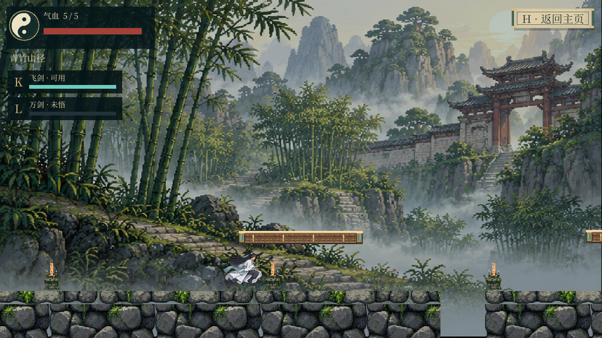

# 武侠遗境 · Wuxia Yijing

由 [xuanxuan1126](https://github.com/xuanxuan1126) 策划并持续迭代的像素武侠游戏。白衣剑客重返山门，参悟踏云诀与万剑归宗，破除镇山傀儡与魔化掌门的封印。

本仓库是 Unity / C# 原生版本，当前版本 **1.4**，编辑器版本 **Unity 6000.3.24f1（6.3 LTS）**。游戏创作参考 [Electro-Dig/lantern-ruins](https://github.com/Electro-Dig/lantern-ruins)，保留原项目 MIT 署名；世界观、剑术与无尽成长体系在本项目中重新设计。

## 下载后直接游玩

打开 [Releases](https://github.com/xuanxuan1126/wuxia-yijing/releases)，下载对应系统的离线试玩 ZIP，**完整解压后启动**。无需安装 Unity、Node、Python，无需联网。不要仅复制 exe，需保留整个文件夹。

| 系统 | 启动入口 | 版本与架构 |
| --- | --- | --- |
| Windows | `Windows/WuxiaYijing.exe` | Windows 10 21H1+ / 11，x64 |
| Mac | `macOS/武侠遗境.app` | macOS 12+，Intel / Apple Silicon 通用版 |
| Linux | `Linux/开始游戏.sh` | Ubuntu 22.04 / 24.04，x64 |

Mac 首次如被系统拦截，可在系统设置「隐私与安全性」中允许打开此应用。Linux 若解压软件没有保留执行权限，可在文件属性里允许执行。

## 玩法

- 剧情：青竹山径、悬桥古道、藏剑石窟、镇岳山门与归元禁庭，带序章和归元结局。
- 剑术：挥剑近战、往返飞剑、御剑冲刺和背后法阵发动的万剑归宗。
- 镇山傀儡：震地与冲撞，冲撞可破坏高台并进入硬直。
- 魔灵老祖：随机释放追魂符、三叠震荡与全场魔潮；归元草提供庇护。
- 无尽试炼：每五波石像、每十波魔主，敌人逐渐增强；清波休息后鼠标三选一，可改选再确认，首领提供两次奖励。
- 白衣剑客、黑衣山匪、御剑纸鹤，浅纸卷轴界面与安静器乐配乐。

| 操作 | 按键 |
| --- | --- |
| 移动 | A / D 或左右方向键 |
| 跳跃 | 空格，长按可跃过石像 |
| 挥剑 / 往返飞剑 | J / K |
| 踏云御剑 / 万剑归宗 | Shift / L |
| 交互 | E |
| 暂停 / 返回主界面 / 静音 | Esc / H / M |

## 用 Unity 继续开发

1. 克隆或下载本仓库。
2. Unity Hub 添加仓库根目录，使用 Unity **6000.3.24f1** 打开。
3. 打开 `Assets/Wuxia/Scenes/WuxiaMain.unity`，点击 Play。
4. 「武侠遗境」菜单提供回归检查以及 Windows、macOS、Linux 原生构建。

游玩发行包不需要编辑器；编辑或重新构建项目才需要 Unity 及对应系统的 Build Support 模块。

| 目录 | 内容 |
| --- | --- |
| `Assets/Wuxia/Scripts` | 物理、角色、首领状态机、技能、UI 和音频 |
| `Assets/Wuxia/Resources/Data` | 参数、五关布局、图集裁切及增益配置 |
| `Assets/Wuxia/Resources/Art` | 角色、场景、武器和特效 |
| `Assets/Wuxia/Editor` | 构建入口与回归检查 |
| `Documentation/Attribution` | 素材来源、许可和改编说明 |
| `Documentation/Validation` | 回归记录与真实播放器截图 |
| `Tools` | 可选素材导入、校验与打包工具 |

## 1.4 更新与验证

修正主角头部穿入高台，调整低台与上下台净空；腰剑拆分为衣袍后方的剑身与近侧袖臂下的剑柄，动作切换共享角色位移插值，防止剑穿过衣服。保留原有角色画风与核心玩法。

**447 项自动回归通过**，另有 **49 项离线程序结构检查**。macOS 程序及分享 ZIP 解压后完成真实画面与鼠标测试，未出现运行报错。Windows / Linux 已构建并核对运行库，尚未在对应系统上实机试玩。

## 来源与许可

- 原始游戏参考：[Electro-Dig/lantern-ruins](https://github.com/Electro-Dig/lantern-ruins)，MIT。
- 本仓库代码：MIT，见 [LICENSE](LICENSE)。新增与改编贡献归属 xuanxuan1126。
- 游戏素材**不统一采用代码的 MIT 许可**。CC0、CC BY 3.0、CC BY 4.0、SIL OFL 与生成素材分别记录，使用时需遵循各自条款。
- 详见 [Unity 素材来源](Documentation/Unity素材来源.md)、[历史素材来源](Documentation/HTML素材来源.md)、[贡献说明](CONTRIBUTING.md)。

图片工具生成的角色和应用图标均按实际来源记录，不冒充下载的 CC0 素材。Unity 编辑器及游戏运行时依照 Unity 自身许可。
