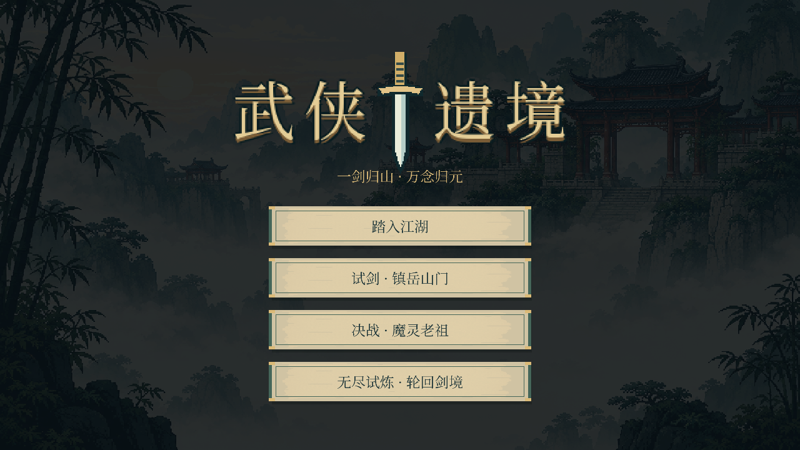
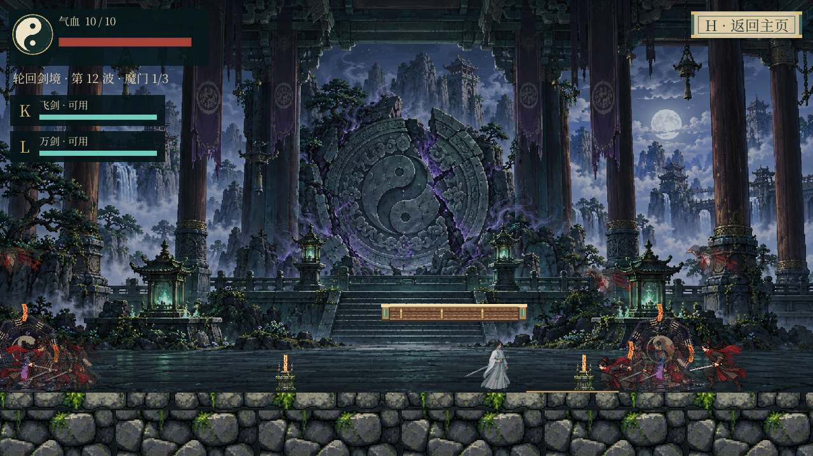
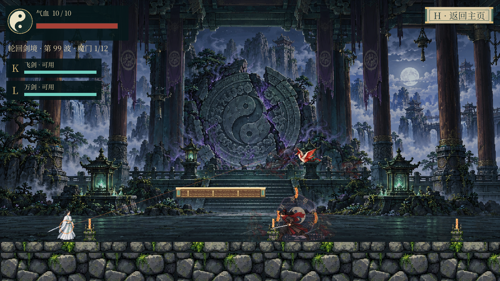
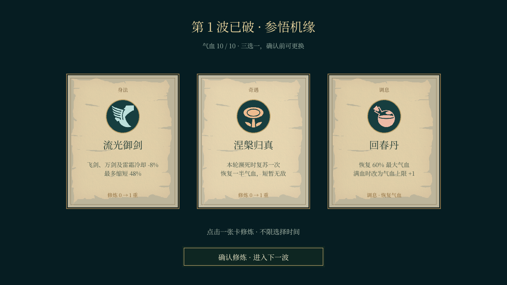

# 武侠遗境 · Wuxia Yijing

由 [xuanxuan1126](https://github.com/xuanxuan1126) 策划并持续迭代的像素武侠游戏。白衣剑客重返山门，参悟踏云诀与万剑归宗，破除镇山傀儡与魔化掌门的封印。

本仓库是 Unity / C# 原生版本，当前发布版本 **1.7.1（最终版）**，编辑器版本 **Unity 6000.3.24f1（6.3 LTS）**。游戏创作参考 [Electro-Dig/lantern-ruins](https://github.com/Electro-Dig/lantern-ruins)，保留原项目 MIT 署名；世界观、剑术与无尽成长体系在本项目中重新设计。

## 下载后直接游玩

桌面「最终版」项目的 `试玩程序` 文件夹包含三平台离线程序。打开 [1.7.1 最终版下载](https://github.com/xuanxuan1126/wuxia-yijing/releases/tag/v1.7.1)，下载对应系统的离线试玩 ZIP，**完整解压后启动**。无需安装 Unity、Node、Python，无需联网。不要仅复制 exe，需保留整个文件夹。

| 系统 | 启动入口 | 版本与架构 |
| --- | --- | --- |
| Windows | `Windows/WuxiaYijing.exe` | Windows 10 21H1+ / 11，x64 |
| Mac | `macOS/武侠遗境.app` | macOS 12+，Intel / Apple Silicon 通用版 |
| Linux | `Linux/开始游戏.sh` | Ubuntu 22.04 / 24.04，x64 |

Mac 首次如被系统拦截，可在系统设置「隐私与安全性」中允许打开此应用。Linux 若解压软件没有保留执行权限，可在文件属性里允许执行。

## 玩法

- 剧情：青竹山径、悬桥古道、藏剑石窟、镇岳山门与归元禁庭，带序章和归元结局。
- 剑术：挥剑近战、往返飞剑、御剑冲刺和背后法阵发动的万剑归宗。
- 镇山傀儡：震地与冲撞，冲撞可破坏高台并进入硬直。
- 魔灵老祖：随机释放追魂符、三叠震荡与全场魔潮；归元草提供庇护。
- 无尽试炼：每五波石像、每十波魔主，敌人逐渐增强；第四波起每波多批魔门伏兵，小批数、人数、生命和攻击持续增长，清完才开下一批；独立设计的玄甲剑卫、符刃门徒与墨羽灵鸦加入战场。清波休息后鼠标三选一，可改选再确认，首领提供两次奖励。
- 白衣剑客、黑衣山匪、御剑纸鹤，浅纸卷轴界面与安静器乐配乐。

| 操作 | 按键 |
| --- | --- |
| 移动 | A / D 或左右方向键 |
| 跳跃 | 空格，长按可跃过石像 |
| 挥剑 / 往返飞剑 | J / K |
| 踏云御剑 / 万剑归宗 | Shift / L |
| 交互 | E |
| 暂停 / 返回主界面 / 静音 | Esc / H / M |

## 用 Unity 继续开发

1. 克隆或下载本仓库。
2. Unity Hub 添加仓库根目录，使用 Unity **6000.3.24f1** 打开。
3. 打开 `Assets/Wuxia/Scenes/WuxiaMain.unity`，点击 Play。
4. 「武侠遗境」菜单提供回归检查以及 Windows、macOS、Linux 原生构建。

游玩发行包不需要编辑器；编辑或重新构建项目才需要 Unity 及对应系统的 Build Support 模块。

| 目录 | 内容 |
| --- | --- |
| `Assets/Wuxia/Scripts` | 物理、角色、首领状态机、技能、UI 和音频 |
| `Assets/Wuxia/Resources/Data` | 参数、五关布局、图集裁切及增益配置 |
| `Assets/Wuxia/Resources/Art` | 角色、场景、武器和特效 |
| `Assets/Wuxia/Editor` | 构建入口与回归检查 |
| `Documentation/Attribution` | 素材来源、许可和改编说明 |
| `Documentation/Validation` | 回归记录与真实播放器截图 |
| `Tools` | 可选素材导入、校验与打包工具 |

## 1.7.1 最终版（含群敌试炼与成长卡）

御剑飞行取消角色背后的起步粒子，保留脚下飞剑、御剑动作和已习得剑诀的攻击效果。

保留1.5版主角、跑步、佩剑、剑阵与三张纸卡的美术。卡池从12张扩充到20张，新增四张属性与四张自动剑诀：

| 属性卡 | 每重效果 | 剑诀卡 | 表现与机制 |
| --- | --- | --- | --- |
| 追风步 | 移速 +6% | 惊鸿剑雨 | 7.5秒落下多柄真剑，升级增加剑数与伤害 |
| 凌霄步 | 御剑冷却 -12% | 太虚剑指 | 8秒打出两道贯穿沿途敌人的剑气 |
| 护体罡气 | 所受伤害 -8% | 焚邪剑印 | 6.5秒结印，0.8秒预告后爆发范围伤害 |
| 剑心澄明 | 会心几率 +8%，会心伤害165% | 回风剑舞 | 御剑收势回斩附近追兵，不产生角色残像 |

自动剑诀无须额外按键，其冷却同时受流光御剑影响。选择卡牌时可反复改选，确认后才应用加成。

无尽难度持续成长：大波越靠后，小批数量和每小批总人数越多；同一大波中后续小批的生命与攻击也继续提高。第4波两批共24只，第39波六批共120只，第99波十二批共420只。人数较多时从召灵阵分段补齐，同屏最多18只，但不会删减每批应有的敌人。当前小批出完且全被击败才开启下一批。近战、飞刃与追魂符均采用出场敌人的实际攻击属性。

第6波加入符刃门徒、第8波加入玄甲剑卫、第12波加入墨羽灵鸦；三种造型以原游戏细致像素风独立制作，不复用掌门图。首领规则、双奖励、原版主角跑步和御剑姿势保留。普通跑步没有额外拖尾，阵亡敌人及时清理。

**778项玩法回归通过**，其中252项覆盖逐批人数、分段出场、成长属性、真实攻击伤害和实体清理。实际macOS运行与鼠标选卡报告在 `Documentation/Validation/NativePlayer17Growth`。Windows/Linux完成交叉构建和依赖检查，未在对应系统实机试玩。

新敌人使用内置 image_gen 制作，选定原图及完整提示词在 [1.7素材记录](Documentation/Attribution/Unity1.7/素材说明.md)，不是下载的CC0素材。八卦召灵阵与卡牌图标为CC BY 3.0，灵雾为CC0；许可在 [原来源记录](Documentation/Attribution/Unity1.6/来源与修改说明.md)。完整增长曲线与调度说明见 [1.7设计说明](Documentation/群敌试炼1.7.md)。

## 1.5 美术迁移

按创作者指定的「武侠遗境_雷符图标版_2026-10-04」恢复 HTML 版的美术呈现：

- 主角使用原版八帧完整跑步原画与原始锚点，衣袍与站立/攻击造型保持统一。
- 恢复修长原剑，腰间七像素宽的护手保留可读性；剑身在衣袍后、护手在身前、近袖在剑上，御剑时切换完整剑。
- 万剑归宗恢复背后双环法阵、柔光蓄力、十二剑向外展开、青玉至金色的弯曲剑轨、原版命中光芒与贯穿光线、累积伤害数字反馈。寻敌锁定与连续碰撞检测保留。
- 无尽机缘恢复三张286×342纸卡、圆形技能纹章、简洁独立确认按钮；确认前可反复改选，回血只在确认时生效，首领保留两次奖励。
- 不变更关卡、技能数值、首领机制、角色碰撞盒或已有穿模修复。

**488 项自动回归通过**（包含41项美术迁移与交互检查）。macOS实际运行与UGUI鼠标选卡验证通过，未出现运行报错。Windows / Linux构建与离线依赖验证见 `Documentation/Validation`；尚未在对应系统实机试玩。

原始图像校验见 `Documentation/Validation/html-art-provenance.json`；移植取舍与许可见 `Documentation/HTML美术迁移1.5.md`。

## 1.4 已完成的碰撞与跨平台验证

修正主角头部穿入高台，调整低台与上下台净空；腰剑拆分为衣袍后方的剑身与近侧袖臂下的剑柄，动作切换共享角色位移插值，防止剑穿过衣服。保留原有角色画风与核心玩法。

**447 项自动回归通过**，另有 **49 项离线程序结构检查**。macOS 程序及分享 ZIP 解压后完成真实画面与鼠标测试，未出现运行报错。Windows / Linux 已构建并核对运行库，尚未在对应系统上实机试玩。

## 来源与许可

- 原始游戏参考：[Electro-Dig/lantern-ruins](https://github.com/Electro-Dig/lantern-ruins)，MIT。
- 本仓库代码：MIT，见 [LICENSE](LICENSE)。新增与改编贡献归属 xuanxuan1126。
- 游戏素材**不统一采用代码的 MIT 许可**。CC0、CC BY 3.0、CC BY 4.0、SIL OFL 与生成素材分别记录，使用时需遵循各自条款。
- 详见 [Unity 素材来源](Documentation/Unity素材来源.md)、[历史素材来源](Documentation/HTML素材来源.md)、[贡献说明](CONTRIBUTING.md)。

图片工具生成的角色和应用图标均按实际来源记录，不冒充下载的 CC0 素材。Unity 编辑器及游戏运行时依照 Unity 自身许可。
